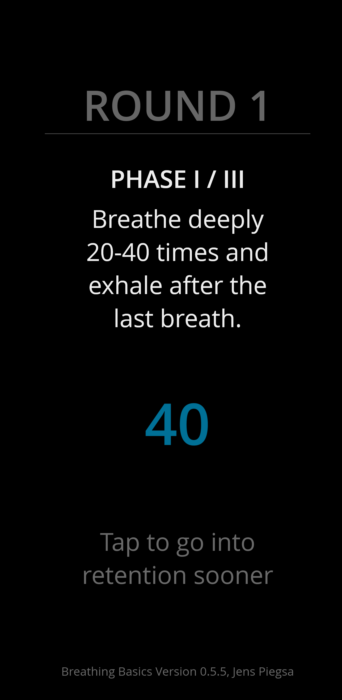
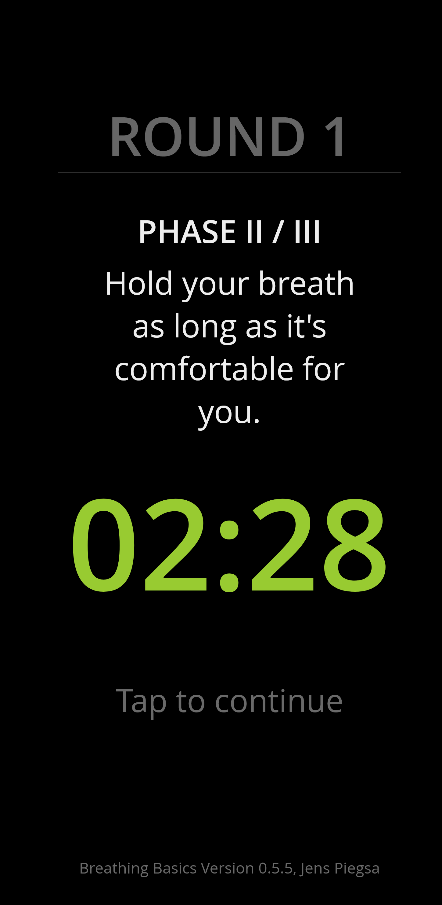
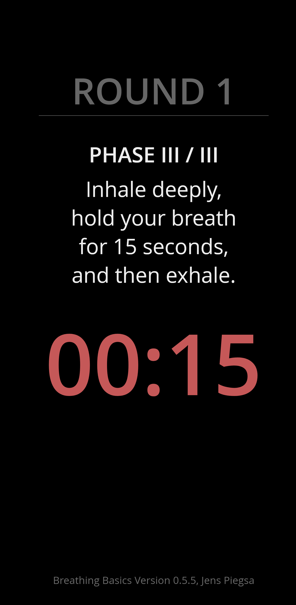

# Breathing Basics #

This is a [deep breathing and retention timer](https://jenspiegsa.github.io/breathing-basics/).

## Features ##

|     |     |
| --- | --- |
| ℹ guided breathing exercise, try to do 3-4 rounds | 😃 free of charge, no ads, open source |
| 🔊 auditory cues for breathing and retention | 🖥️ runs on mobile devices and on desktop browsers |
| 🕒 finish exercise phases whenever it feels right | 🚫 privacy first: no data is collected | 
| 🐌 no competition, no need to chase numbers | 🌙 minimal dark color theme |

## Screenshots ##

  
